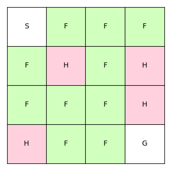

# Monte Carlo Tree Search

## Introduction
This project applies Monte Carlo Tree Search (MCTS) to a simple grid world. We use the Upper Confidence Bounds for Trees (UCT) algorithm. UCT is the most popular MCTS algorithm.

The implementation is based on [A Survey of Monte Carlo Tree Search Methods](http://mcts.ai/pubs/mcts-survey-master.pdf).

## Environment

We use FrozenLake as an environment. The agent starts at S with the goal to move to G. The agent can walk over the 
frozen surface F and needs to avoid holes H:

.

The agent can take 4 possible actions:
```
0 left
1 down
2 right
3 up
```


## Example

If we are in state 0 and move left (action=0) we will get to state 0 again. The tree policy adds the new state 0 to the old 
state 0. The default policy uses the new state to simulate the reward. The simulation returns a reward of 0:

```
0: (action=None, visits=1, reward=0, ratio=0.0000)
└── 0: (action=0, visits=1, reward=0, ratio=0.0000)
```

After moving left there are 3 actions left (down, right, up). If we move down (action=1) we will get to state 4. 
The tree policy adds the new state 4 to the tree. For this state the simulation returns a reward of 1. 
This reward is backpropagated to all nodes visited during this iteration:

```
0: (action=None, visits=4, reward=1, ratio=0.2500)
├── 0: (action=0, visits=1, reward=0, ratio=0.0000)
├── 0: (action=3, visits=1, reward=0, ratio=0.0000)
├── 4: (action=1, visits=1, reward=1, ratio=1.0000)
└── 1: (action=2, visits=1, reward=0, ratio=0.0000)
```

If state 0 is not expandable anymore the tree policy will select the child with the highest value

```python

value = exploitation_term + exploration_term.

```

State 4 has the highest value and is therefore the state that we expand next:

```
0: (action=None, visits=5, reward=1, ratio=0.2000)
├── 0: (action=0, visits=1, reward=0, ratio=0.0000)
├── 0: (action=3, visits=1, reward=0, ratio=0.0000)
├── 4: (action=1, visits=2, reward=1, ratio=0.5000)
│   └── 0: (action=3, visits=1, reward=0, ratio=0.0000)
└── 1: (action=2, visits=1, reward=0, ratio=0.0000)
```